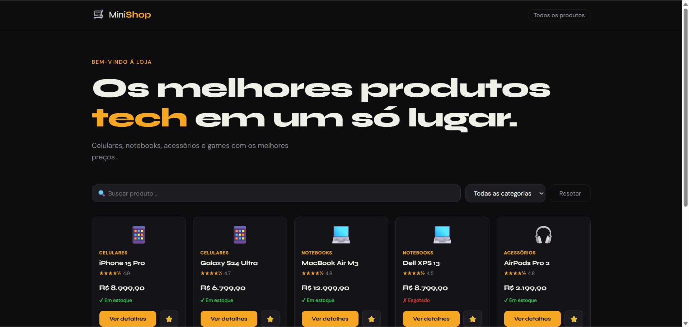
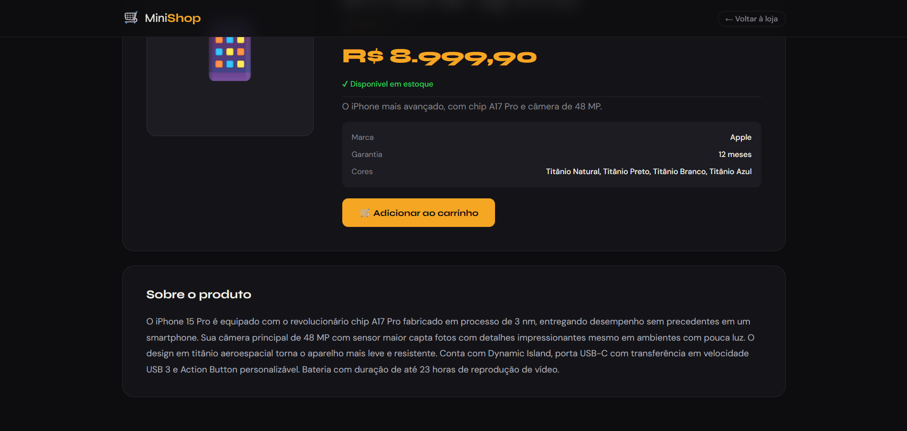

[](https://classroom.github.com/a/jBAz0Mjg)
# Trabalho Prático - Semana 11

Nesta atividade, vamos evoluir o projeto em que estamos trabalhando nesse semestre, acrescentando a página de detalhes.

Imagine que a página principal (home-page) mostre um visão dos vários itens que existem no seu site. Ao clicar em um item, você é direcionado pra a página de detalhes. A página de detalhe vai mostrar todas as informações sobre o item do seu projeto, seja esse item uma notícia, filme, receita, lugar turístico ou evento.

## Informações Gerais

- Pedro Marcos Costa 
- 924394
- um site de venda de aparelhos eletronicos com os detalhes sendo os detalhes do produto e uma pagina para adicionar ao carrinho

## Prints do trabalho





## Dados em JSON
Inclua aqui a estrutura de dados definida por você para o projeto com pelo menos dois exemplo de dados.

```json

{
    id: 1,
    nome: "iPhone 15 Pro",
    preco: 8999.90,
    categoria: "Celulares",
    emEstoque: true,
    imagem: "📱",
    descricao: "O iPhone mais avançado, com chip A17 Pro e câmera de 48 MP.",
    conteudo: "O iPhone 15 Pro é equipado com o revolucionário chip A17 Pro fabricado em processo de 3 nm, entregando desempenho sem precedentes em um smartphone. Sua câmera principal de 48 MP com sensor maior capta fotos com detalhes impressionantes mesmo em ambientes com pouca luz. O design em titânio aeroespacial torna o aparelho mais leve e resistente. Conta com Dynamic Island, porta USB-C com transferência em velocidade USB 3 e Action Button personalizável. Bateria com duração de até 23 horas de reprodução de vídeo.",
    avaliacao: 4.9,
    marca: "Apple",
    garantia: "12 meses",
    cores: ["Titânio Natural", "Titânio Preto", "Titânio Branco", "Titânio Azul"]
  },
  {
    id: 2,
    nome: "Galaxy S24 Ultra",
    preco: 6799.90,
    categoria: "Celulares",
    emEstoque: true,
    imagem: "📱",
    descricao: "Tela AMOLED 6.8\", S Pen integrada e câmera de 200 MP.",
    conteudo: "O Samsung Galaxy S24 Ultra define um novo padrão para smartphones Android. A câmera principal de 200 MP com zoom óptico de 10x permite fotografar detalhes a grandes distâncias. O processador Snapdragon 8 Gen 3 garante fluidez em qualquer tarefa. A S Pen integrada oferece experiência de escrita natural diretamente na tela. Com 12 GB de RAM e bateria de 5000 mAh com carregamento rápido de 45W, é o companheiro ideal para profissionais exigentes.",
    avaliacao: 4.7,
    marca: "Samsung",
    garantia: "12 meses",
    cores: ["Titanium Gray", "Titanium Black", "Titanium Violet", "Titanium Yellow"]
  },
  {
    id: 3,
    nome: "MacBook Air M3",
    preco: 12999.90,
    categoria: "Notebooks",
    emEstoque: true,
    imagem: "💻",
    descricao: "Chip M3, 8 GB RAM, SSD de 256 GB, tela Liquid Retina 13.6\".",
    conteudo: "O MacBook Air com chip M3 redefine o que um notebook ultrafino pode fazer. Com até 18 horas de bateria, você trabalha o dia todo sem precisar de tomada. O chip M3 oferece CPU 60% mais rápida e GPU até 2x mais potente que os modelos com Intel. A tela Liquid Retina de 13.6\" com 500 nits de brilho reproduz cores com precisão excepcional. O design sem ventilador garante operação completamente silenciosa. Compatível com todos os aplicativos macOS e com Rosetta 2 para apps legados.",
    avaliacao: 4.8,
    marca: "Apple",
    garantia: "12 meses",
    cores: ["Meia-Noite", "Luz das Estrelas", "Cinza-Espacial", "Dourado"]
  },
  {
    id: 4,
    nome: "Dell XPS 13",
    preco: 8799.90,
    categoria: "Notebooks",
    emEstoque: false,
    imagem: "💻",
    descricao: "Intel Core i7, 16 GB RAM, tela OLED 13.4\" TouchScreen.",
    conteudo: "O Dell XPS 13 é o notebook Windows mais elegante do mercado. Sua tela OLED de 13.4\" com resolução 3.5K oferece contraste infinito e cores vibrantes. O processador Intel Core i7 de 13ª geração e 16 GB de RAM LPDDR5 garantem desempenho excepcional para criadores de conteúdo e desenvolvedores. O design compacto com apenas 1,17 kg facilita o transporte. Conta com teclado de borda a borda, câmera infravermelha para reconhecimento facial e bateria de 55 Wh com carregamento rápido.",
    avaliacao: 4.5,
    marca: "Dell",
    garantia: "12 meses",
    cores: ["Platinum Silver", "Arctic White"]
  },
  {
    id: 5,
    nome: "AirPods Pro 2",
    preco: 2199.90,
    categoria: "Acessórios",
    emEstoque: true,
    imagem: "🎧",
    descricao: "Cancelamento de ruído ativo, chip H2 e áudio espacial personalizado.",
    conteudo: "Os AirPods Pro de 2ª geração elevam o padrão do áudio sem fio. O chip H2 processa o cancelamento de ruído ativo 2x mais rápido que a geração anterior, bloqueando até 29 dB de ruído externo. O Modo de Transparência Adaptável ajusta automaticamente o nível de áudio ambiente. O áudio espacial personalizado com rastreamento de cabeça cria uma experiência de som imersiva em 360°. Resistentes a suor e água (IPX4) com bateria de até 6 horas e 30 minutos adicionais com o estojo MagSafe.",
    avaliacao: 4.8,
    marca: "Apple",
    garantia: "12 meses",
    cores: ["Branco"]
  },
  {
    id: 6,
    nome: "Logitech MX Keys S",
    preco: 899.90,
    categoria: "Acessórios",
    emEstoque: true,
    imagem: "⌨️",
    descricao: "Teclado sem fio premium com retroiluminação adaptativa e Multi-Device.",
    conteudo: "O Logitech MX Keys S é o teclado definitivo para profissionais que passam horas digitando. As teclas esféricas côncavas se adaptam perfeitamente à curvatura dos dedos, reduzindo a fadiga. A retroiluminação adaptativa detecta automaticamente a presença das mãos e ajusta o brilho conforme a iluminação ambiente. Conecta-se a até 3 dispositivos simultaneamente via Bluetooth ou receptor USB-C Logi Bolt. A bateria dura até 10 dias com retroiluminação ou 5 meses sem ela.",
    avaliacao: 4.6,
    marca: "Logitech",
    garantia: "24 meses",
    cores: ["Grafite", "Rosa"]
  },
  {
    id: 7,
    nome: "PlayStation 5 Slim",
    preco: 3999.90,
    categoria: "Games",
    emEstoque: true,
    imagem: "🎮",
    descricao: "SSD ultrarrápido, 4K HDR, Ray Tracing e leitor de disco destacável.",
    conteudo: "O PlayStation 5 Slim traz toda a potência do PS5 original em um corpo 30% mais compacto. O SSD personalizado com velocidade de 5,5 GB/s elimina praticamente os tempos de carregamento. A GPU de 10,3 teraflops suporta Ray Tracing em tempo real e resolução 4K nativa a 60fps. O controle DualSense com feedback háptico e gatilhos adaptativos cria uma imersão inédita nos jogos. Compatível com toda a biblioteca do PS4. Agora com leitor de disco destacável e suporte WiFi 6.",
    avaliacao: 4.9,
    marca: "Sony",
    garantia: "12 meses",
    cores: ["Branco", "Preto"]
  },
  {
    id: 8,
    nome: "Xbox Series X",
    preco: 3599.90,
    categoria: "Games",
    emEstoque: false,
    imagem: "🎮",
    descricao: "4K nativo a 120fps, 1 TB SSD NVMe e Game Pass Ultimate incluso.",
    conteudo: "O Xbox Series X é o console mais potente da Microsoft, com 12 teraflops de poder de processamento e suporte a 4K nativo a 120fps. O SSD NVMe de 1 TB e a tecnologia Xbox Velocity Architecture eliminam os tempos de carregamento e permitem suspender até dois jogos simultaneamente com Quick Resume. O Game Pass Ultimate inclui acesso a mais de 400 jogos. O controle sem fio Xbox foi redesenhado com botão de compartilhamento, grip texturizado e compatibilidade com acessórios de gerações anteriores.",
    avaliacao: 4.7,
    marca: "Microsoft",
    garantia: "12 meses",
    cores: ["Preto Carbon"]
  }

